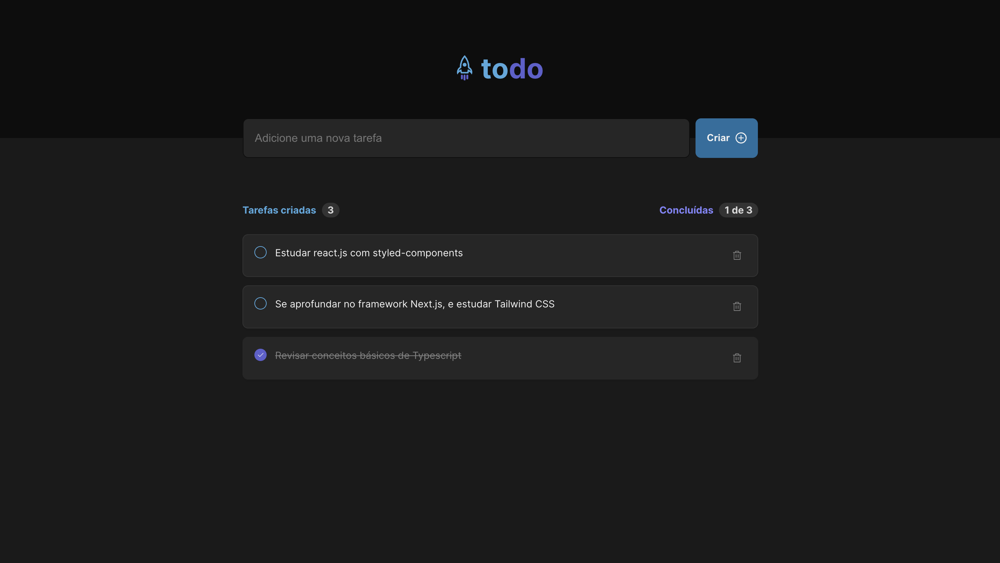

<h1 align="center">
    # To-do-list challenge 01
</h1>

  <a href="#-tecnologias">Tecnologias</a>&nbsp;&nbsp;&nbsp;|&nbsp;&nbsp;&nbsp;
  <a href="#-projeto">Projeto</a>&nbsp;&nbsp;&nbsp;|&nbsp;&nbsp;&nbsp;
  <a href="#-layout">Layout</a>&nbsp;&nbsp;&nbsp;|&nbsp;&nbsp;&nbsp;
  <a href="#memo-licença">Licença</a>

 

  

 

  

## 🚀 Tecnologias

Esse projeto foi desenvolvido com as seguintes tecnologias:

- [React](https://reactjs.org)
- [TypeScript](https://www.typescriptlang.org/)

## 💻 Projeto

Este é o primeiro desafio proposto pelo bootcamp de especialização em React.js do Ignite atualizado: uma to-do-list. É relativamente simples, mas o suficiente para praticar os principais fundamentos da biblioteca. O desafio cobre somente o layout desktop!

## 🔖 Layout

Nos links abaixo você encontra o layout do projeto web. Lembrando que você precisa ter uma conta no [Figma](http://figma.com/) para acessá-lo.

- [Layout Figma](https://www.figma.com/file/scVs89a5J1N1JIDIZgDHoU/ToDo-List-%E2%80%A2-Desafio-React-Copy?fuid=1250085083769040033)
- [Vercel](https://to-do-list-challenge-ignite.vercel.app/)

## :memo: Licença

Esse projeto está sob a licença MIT. Veja o arquivo [LICENSE](LICENSE.md) para mais detalhes.

---